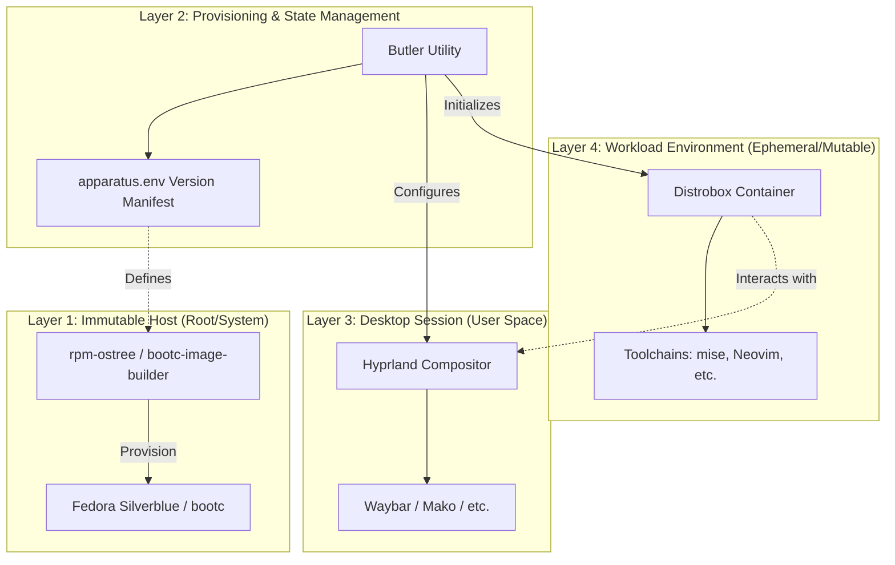

# Apparatus System Architecture

This document defines the architectural boundaries and configuration flow of the Apparatus OS. For SRE and DevOps engineers, understanding the isolation layers between the host-level immutable OS and the containerized workload environments is essential for maintaining environment predictability.

## 🏗️ Architectural Layers

Apparatus is built on a multi-layered isolation model:

## 🔄 Configuration & State Flow

The management of the system follows an "Infrastructure as Code" philosophy:

1.  **Definition (`apparatus.env`)**: The single source of truth for versioned dependencies and component constraints.
2.  **Provisioning (`butler init`)**: The mechanism that applies the defined state to the user's home directory (`~/.config`) and prepares the host environment.
3.  **Execution (`distrobox`)**: The mechanism for spinning up isolated, reproducible execution environments that inherit the desktop's high-performance characteristics (e.g., GPU acceleration via Wayland) but maintain strict separation from the host's core system files.

## 🛡️ Security & Isolation Boundaries

*   **Host Boundary**: The host OS is immutable. Any changes to the host-level packages require an `rpm-ostree` rebase and a reboot.
*   **User Boundary**: User configurations are managed via `butler` and `chezmoi`, ensuring that even if the user's home directory is modified, the system can be reset to a known good state.
*   **Workload Boundary**: The `distrobox` containers are logically separated from the host. Tools installed in a container (e.g., a specific version of Python or Node) do not pollute the host's package manager or environment variables.
